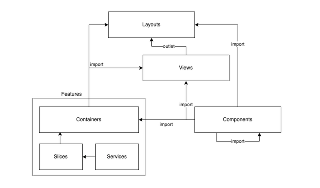

# Fillet | FilletJS Gerador

## **Instalação**

Yarn
```
yarn global add filletjs
```
NPM
```
 npm install filletjs -g
```
## **Uso**

Para criar uma nova aplicação:
```
fillet new my-app
```
ou
```
npx filletjs new my-app
```
Após a instalação, abra o diretório da sua aplicação:
```
cd my-app
```
Dentro do projeto execute:
```
yarn start
```
ou
```
npm start
```
A aplicação irá iniciar em modo desenvolvimento:
Abra o navegador [http://localhost:4000](http://localhost:4000)

## **Compilar**

Para compilar o projeto para **produção** execute:
```
yarn build
```
ou
```
npm run build
```
Para compilar para **homologação**:
```
yarn build:homolog
```
ou
```
npm run build:homolog
```

## **Arquitetura**


### **Componentes**
São blocos de códigos reutilizáveis que compõe o design system. Nessa camada não deve haver nenhum tipo de integração.
```
 fillet g component <your-component>/<variation>
```
ex:
```
fillet g component menu
fillet g component menu/item
```
### **Features**
Tem como finalidade implementar regras de negócios complexas e/ou de integração. Essa camada é responsável por gerenciar os dados, através do Redux Toolkit.
```
 fillet g feature <your-feature>
```
ex:
```
 fillet g feature account
```
### **Containers**
São responsáveis por manipular e exibir dados de uma feature.
```
 fillet g container <your-feature>/<context>
```
ex:
```
 fillet g container account/list
```
### **Views**
São ligadas ao arquivo de rotas. Elas são responsáveis por mapear o que será exibido na tela a partir de uma url.
```
 fillet g view <your-area>/<page>
```
ex:
```
fillet g view account
fillet g view account/management
```
### **Layouts**
São páginas de estrutura que se repetem dentro do projeto (master pages).
```
 fillet g layout <your-layout>
```
ex:
```
 fillet g layout logged
```
___
> 2024 • https://fillet.com.br/ • FAÇA • FUCE • FORCE